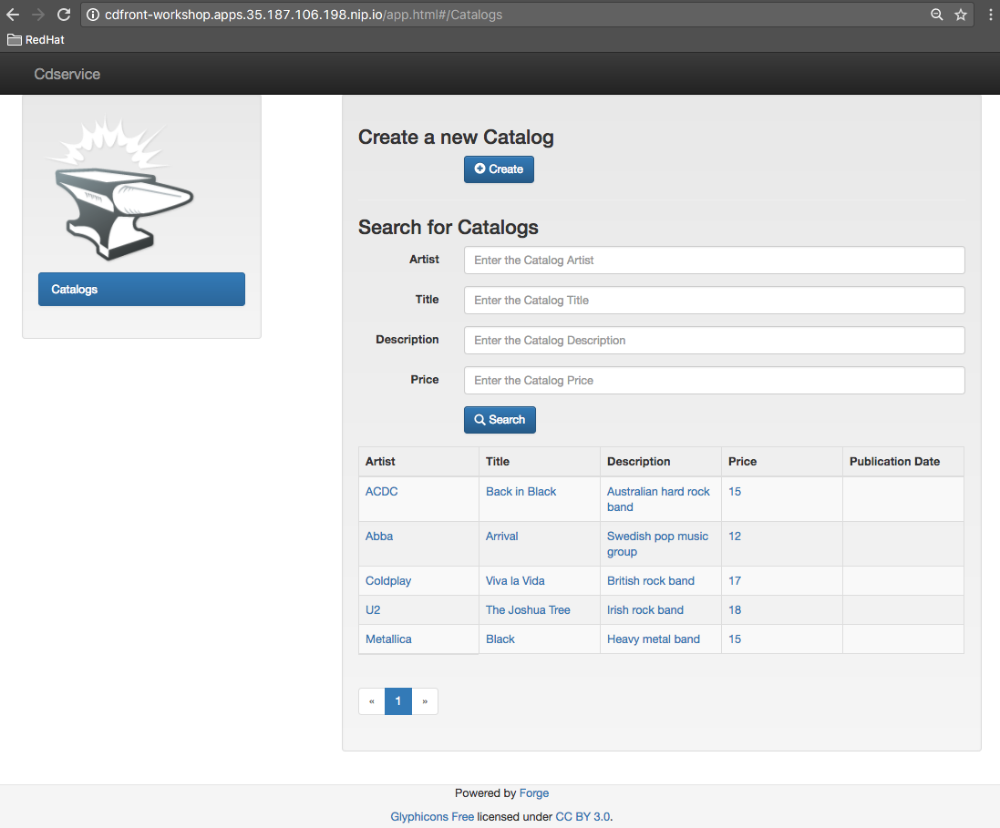

:sectanchors:
:toc: macro
:toclevels: 2
:toc-title: Table of Content
:numbered:

= Hands On Lab with Spring Boot & OpenShift

toc::[]

# Prerequisites

You will need to install the following on your machine:

- [x] http://www.oracle.com/technetwork/java/javase/downloads/jdk8-downloads-2133151.html[JDK 1.8]
- [x] http://maven.apache.org/download.cgi[Maven 3.3.6 or higher]
- [x] http://www.virtualbox.org/wiki/Downloads[Virtualbox 5.0 or higher]
- [x] https://github.com/minishift/minishift/releases/tag/v1.1.0[Minishift v1.1.0]
- [x] http://forge.jboss.org/download[JBoss Forge 3.7 or higher]
- [x] http://developers.redhat.com/products/devstudio/download/?referrer=jbd[JBoss Developer Studio 10 (optional)]
- [x] http://github.com/openshift/origin/releases/tag/v1.5.0[OpenShift Client 1.5.0 (optional)]

NOTE: If you don't have enough memory on your machine to launch a Hypervisor with Minishift, then ask to the instructor to https://goo.gl/1UmVag[have access] to an Openshift platform running in the cloud.

# Installation of OpenShift

In order to use OpenShift platform on your laptop, we will use the Minishift application which has been created from
the Minikube project of Kubernetes. It extends the features proposed by the Kubernetes client to package/deploy
OpenShift within a Linux Virtual Machine. Different hypervisors are supported as Virtualbox, Xhyve & VMWare. You can
find more information about Minishift like also how to install it from the project:
https://docs.openshift.org/latest/minishift/getting-started/installing.html

To create the Virtual Machine, open a Terminal and execute this command to create it using VirtualBox as Hypervisor. The memory allocated to the instance and required is `3Gb`

NOTE: If you have installed xhyve on your laptop, you can remove the `--vm-driver` parameter from the command line

[source,shell]
----
minishift config set memory 3000
minishift config set vm-driver virtualbox

minishift start
Starting local OpenShift cluster using 'virtualbox' hypervisor...
-- Checking OpenShift client ... OK
-- Checking Docker client ... OK
-- Checking Docker version ... OK
-- Checking for existing OpenShift container ... OK
-- Checking for openshift/origin:v1.5.1 image ...
   Pulling image openshift/origin:v1.5.1
   Pulled 0/3 layers, 3% complete
   Pulled 0/3 layers, 46% complete
   Pulled 1/3 layers, 75% complete
   Pulled 2/3 layers, 98% complete
   Pulled 3/3 layers, 100% complete
   Extracting
   Image pull complete
-- Checking Docker daemon configuration ... OK
-- Checking for available ports ... OK
-- Checking type of volume mount ...
   Using Docker shared volumes for OpenShift volumes
-- Creating host directories ... OK
-- Finding server IP ...
   Using 192.168.99.100 as the server IP
-- Starting OpenShift container ...
   Creating initial OpenShift configuration
   Starting OpenShift using container 'origin'
   Waiting for API server to start listening
   OpenShift server started
-- Adding default OAuthClient redirect URIs ... OK
-- Installing registry ... OK
-- Installing router ... OK
-- Importing image streams ... OK
-- Importing templates ... OK
-- Login to server ... OK
-- Creating initial project "myproject" ... OK
-- Removing temporary directory ... OK
-- Checking container networking ... OK
-- Server Information ...
   OpenShift server started.
   The server is accessible via web console at:
       https://192.168.99.100:8443

   You are logged in as:
       User:     developer
       Password: developer

   To login as administrator:
       oc login -u system:admin
----

The OpenShift client is packaged within the Minishift distribution since the version 1.1.0. So, execute this `minishift oc-env` to display the command you need to type into your shell in order to add the `oc` binary to your `PATH`. The output of oc-env will differ depending on OS and shell type.

Now you should be able to log on to your Openshift platform usign the command

----
oc login $(minishift ip) -u admin -p admin
oc login https://HOSTNAME_OR_IP_ADDRESS:8443  -u admin -p admin
----

NOTE: You can retrieve the IP address of the VM where OpenShift is running using the `minishift ip` command.

Next, we will provide more rights for the admin `default` user in order to let it to access the different projects/namespaces to manage the resources.

[source,shell]
----
oc login https://HOSTNAME_OR_IP_ADDRESS:8443 -u system:admin
oc adm policy add-cluster-role-to-user cluster-admin admin
oc login -u admin -p admin
oc project default
----

# Configuration of JBoss Forge tool

In order to use JBoss Forge with this lab, 2 addons should be installed to create a `Spring Boot` project, generate the code and deploy it on the OpenShift platform using the Fabric8 maven plugin.

[source,shell]
----
brew install jboss-forge
forge -i io.fabric8.forge:devops,2.3.88
forge -i org.jboss.forge.addon:spring-boot,1.0.0.Alpha4
----

# Goals

The goal of this lab is to :

- Create a Microservices project composed of an AngularJS Web Front end, a backend application connected to a MySQL database,
- Use Spring Boot technology to design/run the Static Web application and the Java JPA backend,
- Simplify the development of the application, your devtools experience using JBoss Forge,
- Implements the circuit broker pattern,
- Package/Deploy the project on OpenShift,
- Run the Microservices a docker container within the Kubernetes/OpenShift platform,
- Externalize the configuration using https://kubernetes.io/docs/user-guide/configmap/[Kubernetes Config Map]

The project will contain 3 modules; a web static Front end, a backend service exposed by the Spring Boot Java Container and a MySQL database. The JPA layer is managed by Hibernate and with the help of Spring ORM. The front end is a AngularJS application.

Each module will be deployed as a Docker image on OpenShift. The OpenShift Source to Image Tool (= https://docs.openshift.com/enterprise/3.2/creating_images/s2i.html[S2I]) will be used for that purpose.
It will use the Java S2I Docker image responsible to build the final Docker image of your project using the source code of the maven module uploaded to the openshift platform.

This step will be performed using the https://maven.fabric8.io/[Fabric8 Maven Plugin]. This Maven plugin is a Java Kubernetes/OpenShift client able to communicate with the OpenShift platform using the REST endpoints
in order to issue the commands allowing to build aproject, deploy it and finally launch a docker process as a pod.

The project will be developed using your favorite IDEA "IntelliJ, JBoss Developer Studio, .." while the JBoss Forge tool will help us to design the Java application, add the required dependencies, populate the Hibernate in order to:

- Setup the database connection & JPA
- Create the REST Service
- Create the Entity & fields
- Scaffold the AngularJS application (optional)

# Project creation

We will follow the following steps in order to create the maven project containing the modules of our application. Some prerequisites are required like JBoss Forge.
The first thing to be done is to git clone locally the project

. Open a terminal where you will create the `workshop` project
. Git clone the project

  git clone https://github.com/redhat-microservices/lab_springboot-openshift.git

. Change to the directory of the cloned git repository

  cd lab_springboot-openshift

## Decomposed steps

### Parent project

Within the git cloned project, create a project named `workshop` using the maven `archetype:generate` plugin

. Create the parent maven project
+
[source,shell]
----
mvn archetype:generate -DarchetypeGroupId=org.codehaus.mojo.archetypes \
                       -DarchetypeArtifactId=pom-root \
                       -DarchetypeVersion=RELEASE \
                       -DinteractiveMode=false \
                       -DgroupId=org.cdstore \
                       -DartifactId=project \
                       -Dversion=1.0.0-SNAPSHOT
mv project workshop && cd workshop
----

. Verify that your pom.xml file is similar to the following file.
+
[source,xml]
----
<project xmlns="http://maven.apache.org/POM/4.0.0" xmlns:xsi="http://www.w3.org/2001/XMLSchema-instance"
  xsi:schemaLocation="http://maven.apache.org/POM/4.0.0 http://maven.apache.org/xsd/maven-4.0.0.xsd">
  <modelVersion>4.0.0</modelVersion>
  <groupId>org.cdstore</groupId>
  <artifactId>project</artifactId>
  <version>1.0.0-SNAPSHOT</version>
  <packaging>pom</packaging>
  <name>project</name>
</project>
----

### Catalog CD project

. Next create the `cdservice` maven module using the following JBoss Forge command. As this project is a Spring Boot project, we will pass as parameter to JBoss Forge the
  stack to be used which is `spring-boot`. JBoss Forge will create a new maven module, configure the pom.xml file.
  The following command must be executed within the Forge shell or by passing the command using this convention
  `forge -e "..."` where `...` corresponds to a Forge command.
+
[source,shell]
----
project-new --named cdservice --type spring-boot
----

. Setup the JPA project using a `H2` database.
If no database type is specified then `H2` is selected by default. The JBoss Forge command will add a maven GAV H2 artifact and will fill the application.properties file with the Hibernate properties. No datasource is predefined here as we will only use H2 in memory. Note that this command should be executed within the `cdservice` folder, which should be automatically selected after creating the new project.
+
[source,shell]
----
jpa-setup
----

. This command will generate the properties used to configure the Hibernate framework and to access the database
+
[source]
----
spring.jpa.properties.hibernate.show_sql=true
spring.jpa.properties.hibernate.transaction.flush_before_completion=true
spring.jpa.properties.hibernate.format_sql=true
spring.jpa.properties.hibernate.hbm2ddl.auto=create-drop
spring.jpa.properties.hibernate.dialect=org.hibernate.dialect.H2Dialect
----

. Create a Catalog Java (but also entity) class where the fields will be defined as such. It is not required to
define the field with the PRIMARY key as it will be created by default by the JBoss Forge command. Note that Forge
will "switch" to the newly created entity after you perform  a `jpa-new-entity` command so you don't need to specify
the target entity (with `--target-entity`) when creating new fields.
+
[source]
----
jpa-new-entity --named Catalog
jpa-new-field --named artist
jpa-new-field --named title
jpa-new-field --named description --length 2000
jpa-new-field --named price --type java.lang.Float
jpa-new-field --named publication_date --type java.util.Date --temporalType DATE
----

. As we would like to expose our Catalog of CDs as a Service published behind as a REST endpoint, we will use another JBoss Forge command responsible
  to create a RestApplication and the Rest Service ("CatalogEndpoint.class").
+
[source]
----
rest-generate-endpoints-from-entities --targets org.cdservice.model.* --generator SPRING_BOOT_JPA_ENTITY
----

. As the service will be called from a resources which is not running from the same HTTP Server and domain, a REST filter should be created to add the CORS Headers
+
[source]
----
rest-new-cross-origin-resource-sharing-filter
----

### Configure MySQL datasource

. To be able to use the project locally but also on OpenShift, we will define another datasource and JDBC driver to use MySQL that we will install on OpenShift.
. Add a folder `src/main/config-local` containing the application.properties file created.
+
[source]
----
mkdir -p src/main/config-local
cp src/main/resources/application.properties src/main/config-local
----

. Define a maven profile within the `pom.xml` file where we will tell to maven to copy the `src/main/config-local` content to the target folder `src/main/resources`
  when the project will be compiled. Move also the h2 database maven dependency within the profile. This dependency will be detected by Spring Boot when the server will be started
  and by consequence this H2 JDBC Driver will be used.
+
[source,xml]
----
<profile>
  <id>local</id>
  <build>
    <resources>
      <resource>
        <directory>src/main/config-local</directory>
      </resource>
      <resource>
        <directory>src/main/resources</directory>
      </resource>
    </resources>
  </build>
  <dependencies>
    <dependency>
      <groupId>com.h2database</groupId>
      <artifactId>h2</artifactId>
    </dependency>
  </dependencies>
</profile>
----

. Create a new configuration directory `src/main/config-openshift` where we will place what we will use when the application will run on  OpenShift.
+
[source]
----
mkdir -p src/main/config-openshift
----

. Run again the JBoss Forge command `jpa-setup` within the `cdservice` project to generate the spring keys to configure the MySQL datasource and to use MySQL dialect
+
[source]
----
jpa-setup --db-type MYSQL --database-url jdbc:mysql://mysql:3306/catalogdb --username mysql --password mysql
----
. Copy the modified file to the new folder created
+
[source]
----
mv src/main/resources/application.properties src/main/config-openshift
----

. Create another profile called `openshift`
+
[source,xml]
----
<profile>
  <id>openshift</id>
  <build>
    <resources>
      <resource>
        <directory>src/main/config-openshift</directory>
      </resource>
      <resource>
        <directory>src/main/resources</directory>
      </resource>
    </resources>
  </build>
</profile>
----

. Move the `MySQL Maven dependency` from the pom.xml within the `openshift` profile as the MySQL database will only be used when the project will be deployed on OpenShift.
+
[source,xml]
----
...
<profile>
...
<dependencies>
  <dependency>
    <groupId>mysql</groupId>
    <artifactId>mysql-connector-java</artifactId>
  </dependency>
</dependencies>
</profile>
----

. To have a subset of data available within the database, copy the data.sql file to the `src/main/config-local` and `src/main/config-openshift` folders of your project.
. Move to the `workshop` parent folder.
+
[source]
----
cp ../../scripts/service/data-h2.sql src/main/config-local/data.sql
cp ../../scripts/service/data-mysql.sql src/main/config-openshift/data.sql
----

. We can now build the project to be validate that it works for the different profiles.
+
[source]
----
mvn clean compile -Plocal
mvn clean compile -Popenshift
----

### Store Front end

. It is time now to create the store front project & setup Spring Boot. We will for that purpose generate a Spring Boot application able to manage static
content files (html, js, ...) and running using a different port number.
. Execute the following JBoss Forge command within the `workshop` folder.
+
[source]
----
project-new --type spring-boot --named cdfront --create-static-content true --port 8081
----

. Copy the content of the AngularJS application from the this `scripts/front/modified` directory to the `static` folder created under the `cdfront`
+
[source]
----
cp -r ../scripts/front/modified/ cdfront/src/main/resources/static/
----

. Change the address of the `cdservice` http server that the front will access.
  Edit the file `src/main/resources/static/service.json` and add modify the var resource
+
[source,json]
----
{ "cd-service": "http://localhost:8080/rest/catalogs/" }
----

## All in one

The following script (if you want) can help you to setup partially the project in one step. We invite you to first look to the decomposed steps in order to build the project step-by-step before
to use it.

[source]
----
 ./scripts/create_cdstore.sh <PROJECT_NAME>
 where <PROJECT_NAME> corresponds to the name of the directory where the project will be created
----

NOTE: If you want to create the project using another version of JBoss Forge deployed under a different path on your machine, you can pass the parameter to access the forge executable using an env var
      `FORGE_HOME=$HOME/.forge ./scripts/create_cdstore.sh demo`

NOTE: To use the scaffold option, pass the boolean true to the command ` ./scripts/create_cdstore.sh demo true`

## Build and deploy locally

. Open 2 terminal in order to start the front & backend
. cd `cdservice`

  mvn clean compile spring-boot:run -Plocal

. cd `cdfront`

  mvn spring-boot:run -Plocal

. Open the project within your browser `http://localhost:8081`

## Deploy on OpenShift

### Setup MySQL Database

. Log on to OpenShift if you haven't done yet before using the command `oc login`
. Verify first that you are well connected to the `OpenShift` platform by issuing some `oc` commands within a terminal as

  oc status

. Create a new namespace where the microservices will be deployed

  oc new-project workshop

. Create the MySQL application using the OpenShift MySQL Persistent Template
+
[source]
----
oc new-app --template=mysql-persistent \
    -p MYSQL_USER=mysql \
    -p MYSQL_PASSWORD=mysql \
    -p MYSQL_DATABASE=catalogdb
----

WARNING: If you deploy your project on GCP, it is not possible to use persistent volume and then you must install the ephemeral mysql DB
using this command 
`oc new-app --template=mysql-ephemeral -p MYSQL_USER=mysql -p MYSQL_PASSWORD=mysql -p MYSQL_DATABASE=catalogdb`

. Next, check if the Database is up and alive and connect to the pod to execute SQL commands
+
[source]
----
export pod=$(oc get pod | grep mysql | awk '{print $1}')
oc rsh $pod
mysql -u $MYSQL_USER -p$MYSQL_PASSWORD -h $HOSTNAME $MYSQL_DATABASE

mysql> connect catalogdb;
Connection id:    1628
Current database: catalogdb

mysql> SELECT t.* FROM catalogdb.Catalog t;
ERROR 1146 (42S02): Table 'catalogdb.Catalog' doesn't exist
----

NOTE: As we haven't yet deployed the service, the Catalog DB hasn't been yet created by the Hibernate framework so this
      message is expected.
      Note also that there shouldn't be any spaces between the `-p` option and the password you provide to the `mysql` command as otherwise, this will fail.

### Externalize the Datasource

To externalize the datasource configuration that Spring Boot will use to access the database from the
`cdservice` project, we will create a Kubernetes `configMap` resource. This `ConfigMap` will contain as input the
content of the application.properties file. The resource to be created will be defined under a `configmap.json` JSON
file under the `src/main/fabric8` folder. All the resources included within this folder, will be scanned and used by
the Fabric8 Maven Plugin when the application will be deployed on Openshift.

. Create under the directory `src/main/fabric8` of the `cdservice` maven module a `configmap.yml` file.
+
[source,yaml]
----
cd cdservice
mkdir -p src/main/fabric8
cat << 'EOF' > src/main/fabric8/configmap.yml
metadata:
  name: ${project.artifactId}
data:
EOF
----

. Move the content of the `application.properties` file within the `config.yaml` file after the key `data:` and next delete it
+
[source,yaml]
----
metadata:
  name: ${project.artifactId}
data:
  application.properties: |-
    cxf.jaxrs.component-scan=true
    cxf.path=/rest

    spring.datasource.url=jdbc\:mysql\://mysql\:3306/catalogdb
    spring.datasource.username=mysql
    spring.datasource.password=mysql

    spring.jpa.properties.hibernate.transaction.flush_before_completion=true
    spring.jpa.properties.hibernate.show_sql=true
    spring.jpa.properties.hibernate.format_sql=true
    spring.jpa.properties.hibernate.hbm2ddl.auto=create-drop
    spring.jpa.properties.hibernate.dialect=org.hibernate.dialect.MySQLDialect
----

NOTE: As you can see, the hostname defined for the connection-url corresponds to the `mysql` service published on OpenShift (`oc get svc/mysql`).
This name will be resolved by the internal DNS server exposed by OpenShift when the application issues a request to this machine.

. Add dependency to the project to use Spring Cloud Kubernetes Core & config lib which allows Spring Boot to access the Kubernetes Config Map to read the application properties
  keys.
+
[source]
----
project-add-repository --url http://repo.spring.io/libs-snapshot-local --named spring-cloud-snapshot
project-add-dependencies org.springframework.cloud:spring-cloud-starter-kubernetes-config:0.2.0.BUILD-SNAPSHOT
----

. Add a `bootstrap.properties` to specify the name of the application to be used. This name corresponds to the key name of the ConfigMap to search. For our workshop,
the key name is `cdservice`
+
[source]
----
cat << 'EOF' > src/main/config-openshift/bootstrap.properties
spring.application.name=cdservice
EOF
----

. Add the role `view` to the default `serviceaccount` to let the Spring Cloud Kubernetes API to access the ConfigMaps
exposed by the Kubernetes Api. This `serviceaccount` is the pod's account that the application will use to access the
Kubernetes backend. Without this account and the role defined, the platform will generate an error as you aren't authorized to access it (RBAC) !
+
[source]
----
oc policy add-role-to-user view -n $(oc project -q) -z default
----

. In order to access our cdservice outside of the pod/docker container, from the host, we will use the HAProxy deployed by OpenShift to route the traffic from the host the the VM.
  Create a `route.yml` yaml file under the directory `src/main/fabric8`. This file will be used by the Fabric8 Maven Plugin to create on OpenShift a route using target port which is `8080`
+
[source,yaml]
----
cat << 'EOF' > src/main/fabric8/route.yml
apiVersion: v1
kind: Route
metadata:
  name: ${project.artifactId}
spec:
  port:
    targetPort: 8080
  to:
    kind: Service
    name: ${project.artifactId}
EOF
----

. Add the Fabric8 Maven Plugin to the pom.xml file in order to package/deploy the application on OpenShift.
  Issue this JBoss Forge command.
+
[source]
----
fabric8-setup --integration-test=false
----

. Deploy the `cdservice` project on OpenShift using this maven instruction
+
[source]
----
mvn clean fabric8:deploy -Popenshift -DskipTests=true
----

. Check that you can access the REST endpoint of the service using this curl request format `http://CDSERVICE_ROUTE/rest/catalogs`.

  curl http://cdservice-workshop.192.168.99.100.xip.io/rest/catalogs

NOTE: You can retrieve the route ADDRESS to access your service using this command `oc get route/cdservice` or even better `oc get route cdservice --template='{{.spec.host}}'

### Modify the Front to access the backend service

As we have deployed the `cdservice`, we can know check what we should do to allow the `cdfront` application to access the backend.
As the URL to access the service is specified within a `service.json` file, we will change the value of the key to use the URL of the service to access it.

. Edit the `service.json` file under `cdfront/src/main/resources/static` folder & modify the `cd-service` key to use the ADDRESS of the `cdservice`.
  Append `/rest/catalogs` to the ADDRESS.
+
[source,json]
----
{ "cd-service": "http://ADDRESS/rest/catalogs/" }
----

. As we will deploy the CD Front project as a Service that we will route externally from the host machine, we will create 2 OpenShift resources;
  one to configure the service exposed by the Kubernetes Api (gateway) and the other to configure the HA Proxy how to access the service from the host machine
. Add a `svc.yml` under the `src/main/fabric8` folder where the target port is 8081 in order to create a service.
+
[source,yaml]
----
mkdir -p src/main/fabric8/
cat << 'EOF' > src/main/fabric8/svc.yml
apiVersion: v1
kind: Service
metadata:
  name: ${project.artifactId}
spec:
  ports:
    - protocol: TCP
      port: 8080
      targetPort: 8081
  type: ClusterIP
EOF
----

. Create a `route.yml` file under the `src/main/fabric8` to tell to OpenShift to create a route from the Service which exposed our endpoint
+
[source,yaml]
----
cat << 'EOF' > src/main/fabric8/route.yml
apiVersion: v1
kind: Route
metadata:
  name: ${project.artifactId}
spec:
  port:
    targetPort: 8081
  to:
    kind: Service
    name: ${project.artifactId}
EOF
----

. Add the Fabric8 Maven Plugin in order to package/deploy the application on OpenShift.
  Issue this JBoss Forge command.
+
[source]
----
fabric8-setup --integration-test=false
----

. Deploy the cd front project
+
[source]
----
mvn clean compile fabric8:deploy
----

. Retrieve the address of the `cdfront` using the command `oc get route/cdfront --template='{{.spec.host}}'`
. Open your browser and access the front at the address `http://cdfront-workshop.HOSTNAME_OR_IPADDRESS.nip.io/`.

### Generate AngularJS Front (optional)

JBoss Forge offers a command which allows to populate an Angular JS Web Front which contains the UI screens
in order to perform the CRUD operations against the Catalog REST service exposed by the endpoint `http://localhost:8080/rest/catalogs`.

The content is generated from the `CatalogEndpoint` class, part of the `cdservice` project.
The JBoss Forge command will create a project which is supposed to access the service within the same application.
As we will deploy our application as 2 separate microservices, then we will refactor the project generated to pass the URL of the backend service

The next commands explain how you can scaffold your project and next to customize the javascript to pass the URL.

. Scaffold the code within the `cdservice` project using these JBoss forge commands
+
[source]
----
scaffold-setup --provider AngularJS --web-root ../../../../cdfront/src/main/resources/static
scaffold-generate --provider AngularJS --generate-rest-resources --targets org.cdservice.model.* --web-root ../../../../cdfront/src/main/resources/static
----

. Create this `config.js` file within the directory scripts containing a `$http.get` request to access the content
  of the json file which contains the key `cd-service`. This key will contain the hostname or service name to be accessed

[source,javascript]
----
cat << 'EOF' > src/main/resources/static/scripts/services/config.js
angular.module('cdservice').factory('config', function ($http, $q) {
  var deferred = $q.defer();
  var apiUrl = null;
  $http.get("service.json")
    .success(function (data) {
      console.log("Resource : " + data['cd-service'] + ':CatalogId');
      deferred.resolve(data['cd-service']);
      apiUrl = data['cd-service'];
    })
    .error(function () {
      deferred.reject('could not find service.json ....');
    });

  return {
    promise: deferred.promise,
    getApiUrl: function () {
      return apiUrl;
    }
  };
});
EOF
----

. Modify the `scripts/services/CatalogFactory.js` to use the function `config` instead of the hard coded value

[source,javascript]
----
angular.module('cdservice').factory('CatalogResource', function ($resource, config) {
  return $resource(config.getApiUrl() + ':CatalogId', { CatalogId: '@id' }, {
    'queryAll': {
      method: 'GET',
      isArray: true
    }, 'query': { method: 'GET', isArray: false }, 'update': { method: 'PUT' }
  });
});
----

. Update the routeProvider of the `app.js` script to access the service & setup a promise function as the call is asynchronous
[source,javascript]
----
...
.when('/Catalogs',
{
  templateUrl:'views/Catalog/search.html',
  controller:'SearchCatalogController',
  resolve: {
      apiUrl: function(config) {
        return config.promise;
      }
    }
})
...
----

. Edit the app.html page to add the new script externalizing the URL

    

## Enable circuit breaker

Within this section, we will implement the circuit breaker pattern using
https://github.com/Netflix/Hystrix[NetFlix Hystrix] project. The breaker will be developed within
our `CatalogEndpoint` in order to send a dummy record to clients if the database is no longer available. We will
extend the `cdservice` project to support this pattern by first adding an `HystrixCommand` and then register it
with the `CatalogEndpoint` class.

`HystrixCommand` defines 2 methods `run()` and `fallback()` which are called by the `HystrixServlet` via the Java
observable pattern. `run` will be called regularly to check if we get a response from the MySQL database. If, for
some reason, the database fails to answer, the `fallback` method will be called.

The information which corresponds to the status of the Circuit Breaker created, are published by Hystrix regularly as stream of events that we can consult within the
dashboard like also the open/close status.

. Deploy a `Hystrix` Web dashboard using OpenShift command.
+
[source]
----
oc create -f http://repo1.maven.org/maven2/io/fabric8/kubeflix/hystrix-dashboard/1.0.28/hystrix-dashboard-1.0.28-openshift.yml
oc expose service hystrix-dashboard --port=8080
----

. Add the `Spring Boot Hystrix starter` to the pom.xml of the so that the Hystrix classes are made available to the
`cdservice` project. Execute this JBoss Forge command within the `cdservice` project
+
[source]
----
project-add-dependencies org.springframework.cloud:spring-cloud-starter-hystrix:1.2.7.RELEASE
project-add-dependencies org.springframework.boot:spring-boot-starter-actuator:
----

. Add the `hystrix.enabled` label to the service definition (`src/main/fabric8/svc.yml`) as this label will be used by
 the Fabric Hystrix pod to collect the info which are the events required to be send to the Turbine server to provide the status of the Circuit Breaker
+
[source,yaml]
----
cat << 'EOF' > src/main/fabric8/svc.yml
apiVersion: v1
kind: Service
metadata:
  name: ${project.artifactId}
  labels:
    hystrix.enabled: true
spec:
  ports:
    - protocol: TCP
      port: 8080
      targetPort: 8080
  type: ClusterIP
EOF
----

. Disable DB Health Check like the security if you want to monitor the circuit using actuator. So edit the ConfigMap file and append these lines
+
----
    management.health.db.enabled=false
    management.security.enabled=false
----

. Add a `Hystrix` command within the `CatalogEndpoint` where you will define the run and fallback methods of the Circuit Breaker.
. Disable the @Transactional annotation
. Register the command under the Group Key `CatalogGroup`
. Populate a dummy record within the `fallback()` method when the circuit breaker will open
+
[source,java]
----
import com.netflix.hystrix.contrib.javanica.annotation.HystrixCommand;
import com.netflix.hystrix.contrib.javanica.annotation.HystrixProperty;
import java.util.Collections;

@Path("/catalogs")
@Component
//@Transactional
public class CatalogEndpoint {

	@GET
	@Produces("application/json")
	@HystrixCommand(groupKey="CatalogGroup", fallbackMethod = "getFallback")
	public List<Catalog> listAll(@QueryParam("start") Integer startPosition, @QueryParam("max") Integer maxResult) {
			TypedQuery<Catalog> findAllQuery = em
					.createQuery("SELECT DISTINCT c FROM Catalog c ORDER BY c.id", Catalog.class);
			if (startPosition != null) {
				findAllQuery.setFirstResult(startPosition);
			}
			if (maxResult != null) {
				findAllQuery.setMaxResults(maxResult);
			}
			return findAllQuery.getResultList();
	}

	public List<Catalog> getFallback(Integer StartPosition, Integer maxResult) {
		Catalog catalog = new Catalog();
		catalog.setArtist("Fallback");
		catalog.setTitle("Circuit breaker is open as the DB is down !");
		return Collections.singletonList(catalog);
	}
----

. Modify the `DemoApplication` class to add the `@EnableCircuitBreaker` annotation to let Spring to register the Circuit Breaker with Hystrix when it will be started
+
----
import org.springframework.cloud.client.circuitbreaker.EnableCircuitBreaker;

@SpringBootApplication
@EnableCircuitBreaker
public class DemoApplication {
----
+
NOTE: You can also add the annotation using this Forge command `java-add-annotation --annotation org.springframework.cloud.client.circuitbreaker.EnableCircuitBreaker --target-class org.cdservice.DemoApplication`

. Compile the `cdservice` and redeploy the modified `cdservice` pod on OpenShift.
+
[source]
----
mvn clean compile fabric8:deploy -Popenshift -DskipTests=true
----

. Open the Hystrix dashboard and add the ADDRESS of the cdservice `http://cdservice-workshop.192.168.64.25.nip.io/hystrix.stream`
  to view the status of the circuit breaker. It should be `closed`
+
NOTE: You can get the address of the dashboard using the command `oc get route/ --template='{{.spec.host}}'`

. Within a terminal, issue several requests to call the service and scale down the mysql service after a few requests in order to see status changing within the dashboard from `close` to `open`.
+
[source]
----
export ENDPOINT=http://cdservice-workshop.192.168.64.25.nip.io
curl $ENDPOINT/rest/catalogs
for i in `seq 1 100`; do curl $ENDPOINT/rest/catalogs; done
----
+
. Scale down the database.
+
[source]
----
oc scale --replicas=0 dc mysql
----

NOTE: Refresh the CD Front and click on the `catalog` button. A record will be displayed with the info `This is a fallback record`
INFO: You can read more about Hystrix https://github.com/Netflix/Hystrix/wiki/How-it-Works[here].

## Tricks

### Access MySQL DB

You can use the MySQL database running in OpenShift from your local machine if you forward the traffic from the service of the MySQL Database to the host using `port-forwarding` command

[source]
----
export pod=$(oc get pod | grep mysql | awk '{print $1}')
oc port-forward $pod 3306:3306
----

### Add records

In case you want to create some new records or add yours, use this SQL query to insert CD records (if the table has been created !)

[source,sql]
----
INSERT INTO Catalog (id, version, artist, description, price, publicationDate, title) VALUES (1001, 1, 'ACDC', 'Australian hard rock band', 15.0, '1980-07-25', 'Back in Black');
INSERT INTO Catalog (id, version, artist, description, price, publicationDate, title) VALUES (1002, 1, 'Abba', 'Swedish pop music group', 12.0, '1976-10-11', 'Arrival');
INSERT INTO Catalog (id, version, artist, description, price, publicationDate, title) VALUES (1003, 1, 'Coldplay', 'British rock band ', 17.0, '2008-07-12', 'Viva la Vida');
INSERT INTO Catalog (id, version, artist, description, price, publicationDate, title) VALUES (1004, 1, 'U2', 'Irish rock band ', 18.0, '1987-03-09', 'The Joshua Tree');
INSERT INTO Catalog (id, version, artist, description, price, publicationDate, title) VALUES (1005, 1, 'Metallica', 'Heavy metal band', 15.0, '1991-08-12', 'Black');
----

### Using Maven property & ENV

. Add a maven property `cdfront.url` where the value corresponds to a key `${backend.url}`
+
[source]
----
 <cdfront.url>${backend.url}</cdfront.url>
----

. Create a folder `resources` containing a copy of the `scripts/services/CatalogFactory.js` file
+
[source]
----
mkdir -p resources/scripts/services
cp src/main/webapp/scripts/services/CatalogFactory.js resources/scripts/services
----

. Change this line of code `':CatalogId'` to include as prefix the maven property to be filtered
+
[source]
----
sed -i -e "s|\:CatalogId|\$\{cdfront.url\}\:CatalogId|g" resources/scripts/services/CatalogFactory.js
----

. Configure the Maven War plugin to filter the resource
+
[source]
----
<plugin>
  <artifactId>maven-war-plugin</artifactId>
  <configuration>
    <webResources>
      <resource>
        <filtering>true</filtering>
        <directory>resources</directory>
      </resource>
    </webResources>
  </configuration>
</plugin>
----

. Run the project locally and passing the backend.url as property
+
[source]
----
mvn clean package -Dbackend.url=http://localhost:8080/rest/catalogs/
----

. configure the MAVEN_ARGS env var of the Java S2I Build image
+
[source]
----
cat << 'EOF' > src/main/fabric8/deploymentconfig.yml
apiVersion: "v1"
kind: "DeploymentConfig"
metadata:
  name: "cdfront"
spec:
  template:
    spec:
      containers:
      - env:
        - name: "KUBERNETES_NAMESPACE"
          valueFrom:
            fieldRef:
              fieldPath: "metadata.namespace"
        - name: "MAVEN_ARGS"
          value: "-Dbackend.url=http://localhost:8080/rest/catalogs/"
        name: "wildfly-swarm"
  triggers:
  - type: "ConfigChange"
  - imageChangeParams:
      automatic: true
      containerNames:
      - "wildfly-swarm"
      from:
        kind: "ImageStreamTag"
        name: "cdfront:latest"
    type: "ImageChange"
EOF
----
